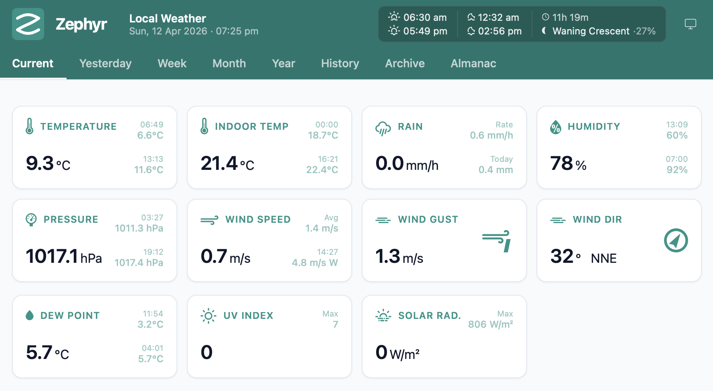
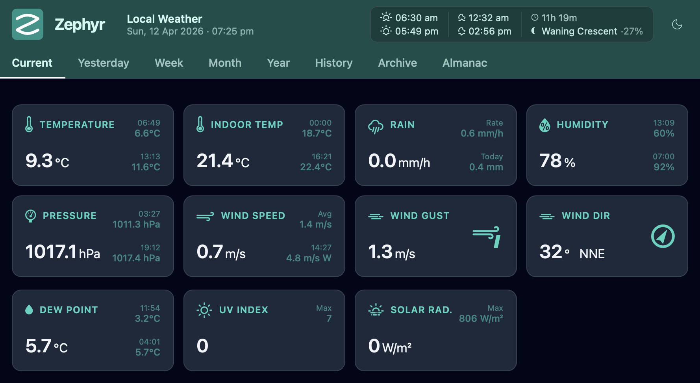
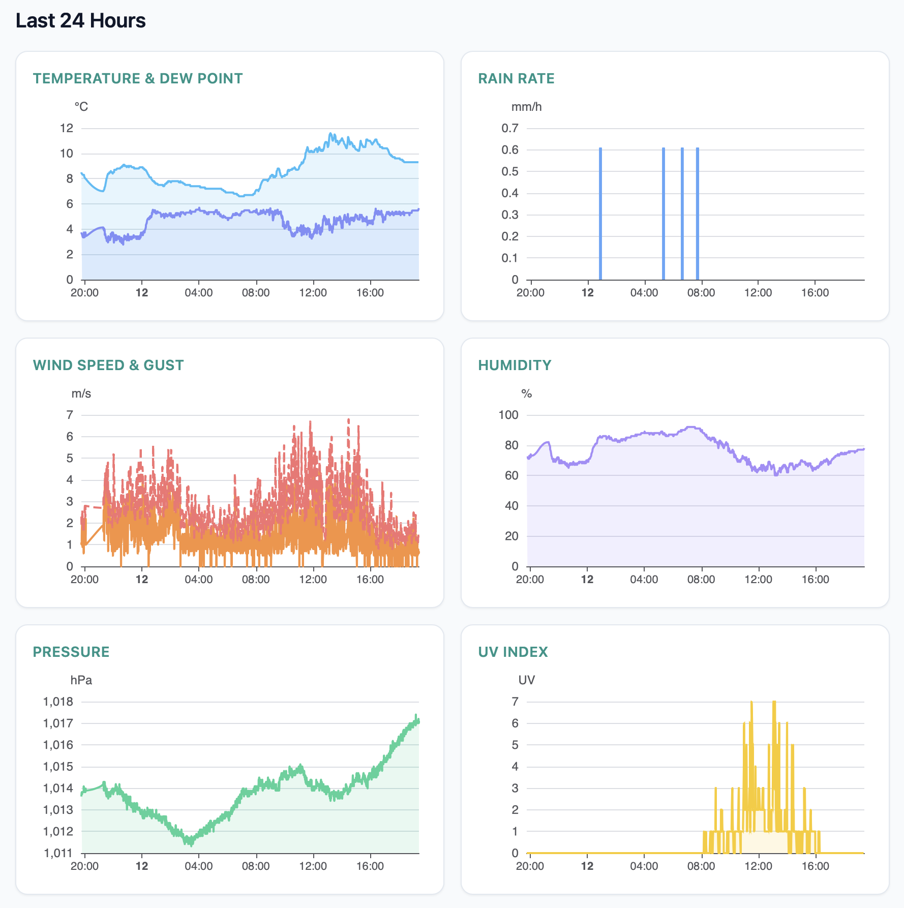
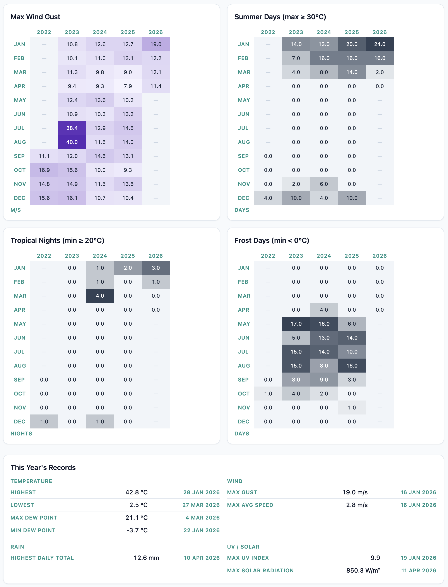
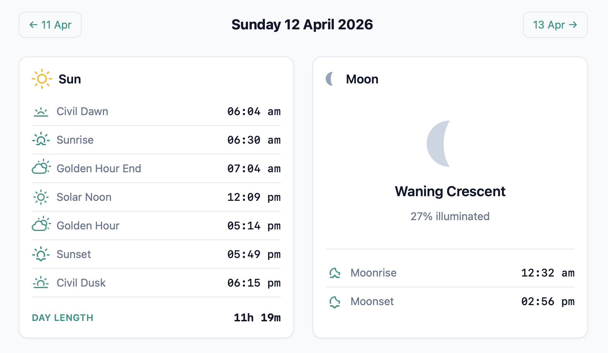

<p align="center">
  <picture>
    <source media="(prefers-color-scheme: dark)" srcset="assets/logo-dark.svg">
    
  </picture>
</p>

<p align="center">
  <a href="https://github.com/cngarrison/zephyr/releases"></a>
  <a href="LICENSE"></a>
  
  
</p>

# Zephyr Weather

A lightweight, engine-first weather station system built with Deno and TypeScript. Zephyr collects, stores and displays weather data from personal weather stations — designed as a modern, extensible alternative to [weewx](https://weewx.com).

## Why Zephyr?

weewx is a capable system but has accumulated complexity over many years of Python 2→3 migration, and its storage layer has known issues with MySQL case-sensitivity that emerged in v5.3. Zephyr takes a fresh approach:

- **Engine-first**: the data collection and storage core is the product. The web UI is one consumer among many.
- **No Python**: pure Deno + TypeScript throughout.
- **Simple by default**: SQLite out of the box, no database server required.
- **Extensible by design**: storage adapters, ingest plugins, and sensor types are all interface-driven.

## Features

### Current

- Personal weather station support via WU push, Ecowitt push, and LAN API poll (currently: Ecowitt GW-series gateways)
- Plugin-based storage system — SQLite (default) and MySQL adapters
- Auto-normalises all data to SI units internally
- Broad sensor support: temperature, humidity, pressure, wind, rain, solar, UV
- Extended sensor support: soil moisture/temperature (8 channels), extra temp/humidity (8 channels), leaf wetness, lightning
- REST API for observations and station config
- Fresh v2 web dashboard with current conditions and weather-icon condition cards
- Today stats: daily high/low and totals on the dashboard
- Aggregate views: yesterday, week, month, year (Apache ECharts)
- History heatmaps: temperature, rain and UV heatmaps by day across all available years
- Almanac: sunrise/sunset times, day length, and moon phase
- Tailwind v4 dark theme
- weewx data migration script

### Planned

- Live updates via SSE (currently polling)
- Third-party embeds (Windy Map, BOM radar, etc.)
- Cloud upload adapters (Weather Underground, Ecowitt, CWOP)
- Static HTML export for HomeAssistant integration
- Themes / skins

## Screenshots

<table>
  <tr>
    <td align="center"><br><sub>Current conditions · Light theme</sub></td>
    <td align="center"><br><sub>Current conditions · Dark theme</sub></td>
  </tr>
  <tr>
    <td align="center"><br><sub>24-hour charts</sub></td>
    <td align="center"><br><sub>History heatmaps &amp; records</sub></td>
  </tr>
  <tr>
    <td colspan="2" align="center"><br><sub>Almanac — sunrise, sunset &amp; moon phase</sub></td>
  </tr>
</table>

## Architecture

```
Gateway ──push──▶ Engine (HTTP :8080)
                  ├── /ingest/wu          WU protocol push
                  ├── /ingest/ecowitt     Ecowitt protocol push
                  ├── /api/observations/latest
                  ├── /api/observations/range?from=&to=
                  ├── /api/observations/aggregate?from=&to=&bucket=
                  ├── /api/observations/today?tz=
                  ├── /api/observations/daily?year=
                  ├── /api/almanac?date=
                  └── /api/config

Browser ◀── Web (Fresh v2, :8081) ◀── Engine REST API
```

Two Deno packages in a workspace:

| Package   | Description                    |
| --------- | ------------------------------ |
| `engine/` | Data ingest, storage, REST API |
| `web/`    | Fresh v2 + Vite dashboard      |

Both compile to self-contained binaries via `deno compile`.

## Quick Start

### Prerequisites

- [Deno](https://deno.com) v2.2+ _(development only — not required for binary or package installs)_
- A personal weather station with a network gateway. Currently, Ecowitt GW-series gateways (GW1000, GW1100, GW2000) are supported via WU push, Ecowitt push, and LAN API polling.

### Setup

```bash
git clone https://github.com/cngarrison/zephyr
cd zephyr
deno install
cp zephyr.toml.example zephyr.toml
# Edit zephyr.toml — set station name, lat/lon, timezone, storage path, etc.
```

### Run (development)

```bash
# Engine only
deno task engine

# Web dev server only
deno task web:dev

# Both
deno task dev
```

### Configure your gateway

Point your gateway to push to the engine:

| Protocol            | URL                                 |
| ------------------- | ----------------------------------- |
| Weather Underground | `http://<host>:8080/ingest/wu`      |
| Ecowitt             | `http://<host>:8080/ingest/ecowitt` |

For Ecowitt gateways (GW1000 etc.): in the Ecowitt app or gateway web UI, go to _Weather Services → Customized_ and set the server IP, path, and port.

### Test ingest

```bash
curl "http://localhost:8080/ingest/wu?tempf=72.5&humidity=65&baromrelin=29.92&windspeedmph=5&winddir=225&solarradiation=450&UV=3"
curl http://localhost:8080/api/observations/latest
```

## Configuration

Zephyr uses a single TOML config file. In development, place `zephyr.toml` in the project root. In production, the default path is `/etc/zephyr/zephyr.toml`.

See [`zephyr.toml.example`](zephyr.toml.example) for all options.

### Key settings

```toml
[engine]
port = 8080
host = "0.0.0.0"

[web]
engine_url = "http://localhost:8080"

[storage]
provider = "sqlite"   # or "mysql"

[storage.sqlite]
path = "/var/lib/zephyr/zephyr.db"

[[stations]]
id     = "my-station"
name   = "My Weather Station"
lat    = 51.5074
lon    = -0.1278
altitude  = 10
timezone  = "Europe/London"

[stations.ingest.push]
enabled = true
```

The `PORT` and `HOSTNAME` environment variables for the web daemon are set via systemd `Environment=` in the unit file and read directly by Fresh — they are not part of `zephyr.toml`.

## Storage

Storage is plugin-based. The `DB_PROVIDER` setting in `[storage]` selects the adapter. Each adapter lives under `engine/src/storage/providers/` and owns its own forward-only migration runner.

| Provider | Config section     | Notes                                                    |
| -------- | ------------------ | -------------------------------------------------------- |
| `sqlite` | `[storage.sqlite]` | Default. `path` supports NFS/network mounts.             |
| `mysql`  | `[storage.mysql]`  | Requires `host`, `port`, `user`, `password`, `database`. |

All values are stored in SI units. Imperial→SI conversion happens in the ingest normaliser.

## REST API

All endpoints are served by the engine on `:8080`. The web daemon proxies `/api/*` and `/ingest/*` requests transparently.

```
GET  /api/observations/latest
GET  /api/observations/range?from=<epoch>&to=<epoch>
GET  /api/observations/aggregate?from=<epoch>&to=<epoch>&bucket=<hour|day>
GET  /api/observations/today?tz=<IANA>
GET  /api/observations/daily?year=<YYYY>
GET  /api/almanac?date=<YYYY-MM-DD>
GET  /api/config

GET  /ingest/wu        (WU protocol push)
POST /ingest/ecowitt   (Ecowitt protocol push)
```

## Development

```bash
# Type check
deno task check:types:all

# Lint
deno lint

# Format
deno fmt

# Build web for production
deno task web:build

# Compile binaries
deno task compile
```

## Installation (Linux server)

### One-liner (tarball)

Installs the latest release, creates the `zephyr` system user, installs systemd
units, and prints next steps:

```bash
curl -fsSL https://raw.githubusercontent.com/cngarrison/zephyr/main/scripts/install.sh | sudo bash
```

Pin to a specific version:

```bash
curl -fsSL https://raw.githubusercontent.com/cngarrison/zephyr/main/scripts/install.sh | sudo bash -s v0.1.1
```

Supports `x86_64` and `aarch64` (including Raspberry Pi 4/5 running 64-bit OS).

### `.deb` package (Debian / Ubuntu)

For `.deb`-managed installs with `apt upgrade` support, see [`docs/deb-install.md`](docs/deb-install.md).

### After installing

Create the config file from the installed example, then start:

```bash
sudo cp /etc/zephyr/zephyr.toml.example /etc/zephyr/zephyr.toml
sudo nano /etc/zephyr/zephyr.toml   # set station name, lat/lon, timezone

sudo systemctl enable --now zephyr.target
journalctl -u zephyr-engine -u zephyr-web -f
```

## Documentation

Full documentation is in the [`docs/`](./docs/) directory.

| Document                                                             | Description                                                       |
| -------------------------------------------------------------------- | ----------------------------------------------------------------- |
| [docs/install.md](./docs/install.md)                                 | All install methods — one-liner, `.deb`, manual, from source      |
| [docs/deb-install.md](./docs/deb-install.md)                         | Detailed `.deb` guide including upgrade and removal               |
| [docs/configure.md](./docs/configure.md)                             | Full `zephyr.toml` configuration reference                        |
| [docs/api.md](./docs/api.md)                                         | REST API reference — all endpoints, parameters, curl examples     |
| [docs/consumers.md](./docs/consumers.md)                             | Building your own dashboard or integration against the engine API |
| [docs/drivers.md](./docs/drivers.md)                                 | Writing a new ingest driver (push or LAN poller)                  |
| [docs/storage-adapters.md](./docs/storage-adapters.md)               | Implementing a new storage adapter                                |
| [docs/themes.md](./docs/themes.md)                                   | Creating a new UI theme                                           |
| [docs/ai-assisted-development.md](./docs/ai-assisted-development.md) | AI-first contribution guide — prompt templates, common pitfalls   |

---

## Contributing

Contributions are welcome and AI-assisted contributions are first-class. The recommended path for most new features is to use a coding assistant with [AGENTS.md](./AGENTS.md) loaded as context — it contains all the project rules, file structure, and step-by-step guides an LLM needs to generate correct code.

See **[docs/ai-assisted-development.md](./docs/ai-assisted-development.md)** for ready-to-use prompt templates for common contribution types (new ingest driver, storage adapter, web route, theme).

Key areas for community extension:

- **Ingest drivers** — support for additional weather station hardware (`engine/src/ingest/`)
- **Storage adapters** — implement `StorageAdapter` interface (`engine/src/storage/adapter.ts`)
- **Cloud uploaders** — Weather Underground, CWOP, Ecowitt cloud, etc.
- **Web themes** — alternative Tailwind/CSS themes
- **LAN API poller parsing** — complete the device LAN API JSON → Observation mapping (`engine/src/ingest/poller.ts`)

See [CONTRIBUTING.md](./CONTRIBUTING.md) for full setup instructions and PR process.

## License

MIT
